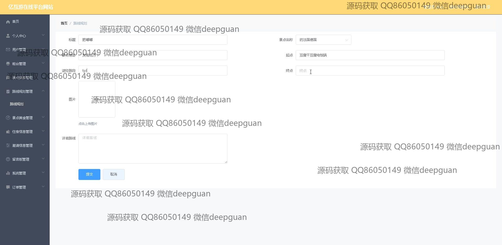

<h1 align="center">亿互游在线平台设计与开发+vue</h1>

## 简介
亿互游在线平台：涵盖用户管理、景点信息、路线规划、留言反馈、个人中心等功能，支持在线旅游信息查询、行程安排、住宿和美食管理，提升用户体验。    --计算机毕业设计源码；毕设源码；java毕业设计源码

## 联系方式

<h3 align="center">获取完整代码与数据库文件 + 微信：deepguan QQ: 86050149 QQ群: 783742310</h3>

<h3 align="center">可帮忙远程部署 包运行成功！提供远程部署、修改代码、设计文档指导、代码讲解等服务！</h3>

## 功能介绍（完整见运行截图）
管理员：能够登录、注册、退出，以及管理用户账号信息。可以访问后台管理界面，进行用户管理、留言管理、路线规划管理、景点美食管理和住宿信息管理等操作。直接进行系统设置和密码修改，管理平台的整体内容，包括添加、修改和删除景点信息和产品信息，处理用户评论和反馈，维护网站的正常运行。实现订单管理和系统各模块的协调。

用户：登录注册后可以访问个人中心，查看和修改个人资料、收货地址和订单。主页面提供景点信息、路线规划、景点美食、住宿信息的查询和浏览功能。使用平台提供的收藏、搜索和反馈选项进行个性化信息管理。可以通过购物车和支付系统进行交易，提供服务预定和结账功能，参与点赞和评论，与网站进行互动。

## 运行截图

本代码来源于网络,仅供学习参考使用!

